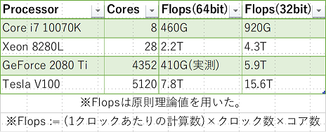

# 1.2 GPUとCPU

CPUとGPUの比較[[1]-[5]]

この図は典型的なCPUとGPUを比較したものである。Core i7とGeForceは一般的なPCとしての用途、XeonとTeslaはサーバー用途で用いられている。
ここで出てくるFlops(FLoating-point Operations Per Second)とは、1秒あたりに浮動小数点型の計算を何回行うことができるかを表しており、コンピュータの性能を表す指標の一つである。

CPUはコアの数こそ少ないものの、[CPU高速化][6][[6]]にあるような高速化技術を駆使して、複雑な条件分岐などを高速に処理している。

対して、GPUはCPUには搭載されている高速化技術を簡素化するかわり、コアを沢山搭載することが可能になっている。
コアを数千集めることでSIMD演算やベクトル計算に対して高速に処理する能力を持っている。
ただその特性上、並列化出来ない部分の多い処理(条件分岐等)に対して良い性能を出すことは出来ない。
> SIMD(single instruction, multiple data): 一つの命令を同時に複数のデータに適用し、並列に処理する方式

ここで、GeForce 2080 Tiの倍精度でのFlopsが極端に低いことに気づいた方がいらっしゃると思う。
これはGeForceシリーズがハードウェアとして32bitマシンを採用しており、倍精度を表現するのに時間がかかるためである。
Teslaの場合は64bitマシンを用いているので、このような問題は起こらない。

## Links
* [次へ](./1.3.md)
* [前へ](./1.1.md)
* [目次](./index.md)

## 引用、紹介
[[1]] [Intel Core i7-10700K - ベンチマークと技術データ][1]

[[2]] [第2世代 インテル® Xeon® スケーラブル・プロセッサー][2]

[[3]] [RTX. IT’S ON. GeForce RTX 2080 Ti][3]

[[4]] [NVIDIA V100 -初のTensorコアGPU-][4]

[[5]] [GPU性能比較ベンチマーク][5]

[[6]] [CPU高速化][6]

[1]: https://www.cpu-monkey.com/ja/cpu-intel_core_i7_10700k-1140
[2]: https://www.hpc.co.jp/product/cpu_intel_xeon-scalable-processors-2nd/
[3]: https://www.nvidia.com/ja-jp/geforce/graphics-cards/rtx-2080-ti/
[4]: https://www.nvidia.com/ja-jp/data-center/v100/
[5]: https://www.hpc-technologies.co.jp/mixbench
[6]: http://www.am.ics.keio.ac.jp/arc/hpcpu.pdf