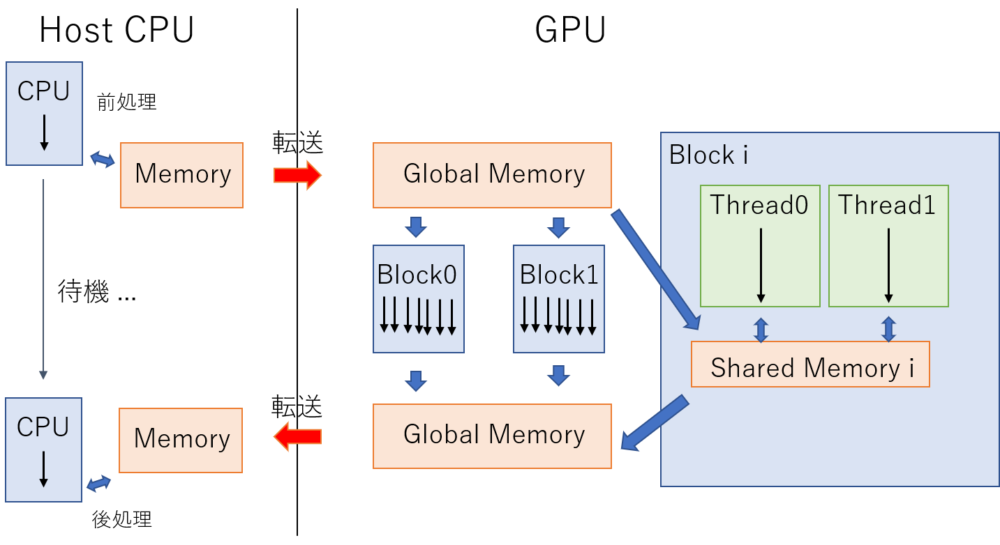

# 1.4 CUDAの概要
## 1.4.1 CUDAとは
GPUを用いたプログラミングを行う際の選択肢の1つにCUDAがある。
特に、C/C++をベースに拡張されたCUDA言語のことをCUDA C/C++と呼び、これからCUDAというときはCUDA C/C++を前提とする。

「CUDAの特徴[[1]]」

* NVIDEA製のGPGPUを使って計算処理を行うための言語
* C/C++をベースにGPUデバイスやメモリを扱えるように拡張したAPIセット
* GPUの具体的な構造に依らない記述が可能
* 多数のドキュメント・サンプルプログラム[[2]]、ユーザがいる

>API(Application Programming Interface): 異なるソフトウェア間を繋げるもの(e.g. GoogleはGoogleの機能の一部をAPIとして外部に公開することで、第三者のサービスでもGoogleアカウントを用いた認証を行う事ができる。言い換えると、Googleと第三者サービスの間をAPIによって結びつけているとも言える。)

2つ目、3つ目について少し補足を加える。
GPUプログラミングに依らず、我々が何かを(例えばCを用いて)プログラミングする際、あなたが持っているPCのCPUやそのメモリの持つ特性を大きく気にせず書くことができるのは、C言語とそのコンパイラがあなたのPCの持つ固有の特性を隠蔽してくれるからである。

CUDAについても同じことが言える。
CUDAを用いると、動かす予定のGPUがどれだけのSM、core/SMを有しているかを大きく気にすることなくプログラミングすることが可能だ。

一方、限界までチューニングする場合に限り、CPUの場合でもGPUの場合でも使用するマシンの特性を理解する必要があるというのは言うまでもない。

1.4.2以降でどのように隠蔽しているかについて、具体的に解説していく。

## 1.4.2 CUDAからみたGPUの構造
CUDAでGPUを用いた並列計算を行う際に必要な概念として、ブロック、スレッドがある。
なお、ここではCUDAによって隠蔽されたGPUの構造のことを「CUDAからみるGPU」と表現する。

CUDAからみるGPUの構造の概略図[3]。レジスタはそれぞれのスレッドが持っている。

CUDAからみるGPUはたくさんのブロックとGlobalメモリと呼ばれるメモリ領域で構成されている。
更にそれぞれのブロックの内部に着目してみると、ブロックの中は千以上のスレッドとSharedメモリと呼ばれるメモリ領域で構成されている。これらのブロックとスレッドはそれぞれ3次元的に配置されており、
指定できるブロック数の上限は(x, y, z): (2147483647, 65535, 65535)、1ブロックあたりで指定できるスレッド数の上限は(x,y,z): (1024, 1024, 64)である。

※注意: 再三述べるが、ブロック、スレッドという概念はCUDAからみるGPUの構造の話であって、実際のGPUの構造を指しているわけではない。両者の関係については[次節](./1.5.md)にて言及する。

上の図の矢印は処理の流れを表している。
1つのスレッドに1つの処理が走り、それらがブロックという単位で束ねられ、更に複数のブロックが束ねられることでGPUには複数の同一命令が並列に走っているように見える。

それぞれのブロックとスレッドには固有のIDがあり、そのIDによって割り振られる似たような処理は非同期的かつ独立に行なわれる。
同期を取る際は場合は専用の命令をGPUに対して呼ぶ必要がある。
この際、ブロック間で同期をとることは出来ないが、スレッド間では同期をとることができる点に留意すること。

メモリについて見ていくと、Globalメモリは数GBの容量を持っており、GPU上のあらゆるブロックからアクセスできる扱いやすいメモリである。

一方ブロック内にあるSharedメモリは数十MB(機種依存性あり)しか容量がなく、そのブロック内でしかアクセスできない代わりにGlobalメモリよりも圧倒的に速いのが特長だ。

従って、処理の効率を上げるためには、なるべくSharedメモリを活用して、メモリアクセスの効率を高めていくことが極めて重要である。

なお、GPU側からCPU上のメモリにアクセスしたり、逆にCPU側からGPU上のメモリにアクセスすることは出来ないので、必要に応じて相互間通信処理を入れる必要がある。

## 1.4.3 CUDAによるプログラミングの大まかな流れ
最後にCUDAを用いた処理の流れをまとめる。

1. CPUによる前処理(メモリの確保やファイルの読み込み)
1. 必要なデータをCPU上のメモリからGlobalメモリに転送
1. GlobalメモリからSharedメモリに必要なデータをコピー
1. 並列処理
1. Sharedメモリから処理後のデータをGlobalメモリに戻す
1. GlobalメモリからCPU上のメモリにデータを転送
1. CPUによる後処理

流れ3. 5. については必要に応じて行うとよい。

## Links
* [次へ](./1.5.md)
* [前へ](./1.3.md)
* [目次](./index.md)

## 引用、紹介
[[1]] [Cyril Zeller, “CUDA C/C++ Basics Supercomputing 2011 Tutorial”][1]

[[2]] [CUDA Toolkit Documentation][2]

[3] 畝山多加志 『大規模並列数値計算特論 GPUプログラミング(1)』2019年度講義資料

[1]: https://docplayer.net/23922327-Cuda-c-c-basics-supercomputing-2011-tutorial-cyril-zeller-nvidia-corporation.html
[2]:https://docs.nvidia.com/cuda/