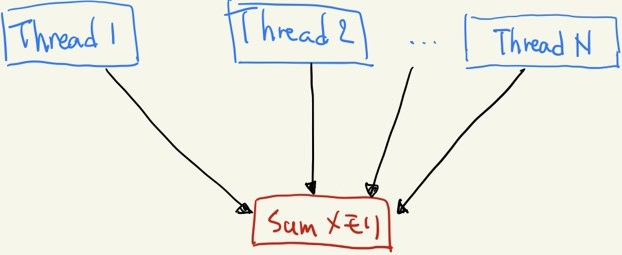

# 5.0 総和計算
莫大な要素の解析で統計量を見るために平均を取る操作はよく行われる。
その際に必ず行われるのが総和計算である。
しかし、並列計算で実現しようとすると少々不具合が生じる。
それはなぜか。

まずは逐次処理で見ていく。CPU総和計算を行うとするとおそらく次のような書き方になるだろう。

```cpp
const int Narr = 1000;

int sum(int *arr){
    int sum = 0;
    for(int i = 0; i < Narr; i++){
        sum += arr[i];
    }
    return sum;
}
```

`sum` というアドレスに対して、配列 `arr` 内の要素を順に全て足し込むことで総和計算を行っている。

では、これと同じことを素朴にCUDAでやろうとすると、おそらく次のようになるはずだ。
カーネルでは値を返せない点に気をつけて、

```cuda
const int Narr = 1000000;
const int NT = 512;
const int NB = (Narr + NT - 1)/NT;

__global__ gpu_sum(int *sum_dev, int *arr_dev){
    int i_global = blockIdx.x * blockDim.x + threadIdx.x;

    if(i_global < Narr){
        *sum_dev += arr_dev[i_global];
    }
}

int sum(int *arr){
    int sum;
    int *sum_dev, *arr_dev;

    cudaMalloc((void**)&sum_dev, sizeof(int));
    cudaMalloc((void**)&arr_dev, Narr * sizeof(int));

    cudaMemcpy(arr_dev, arr, Narr * sizeof(int), cudaMemcpyHostToDevice);

    gpu_sum<<<NB, NT>>>(sum_dev, arr_dev);

    cudaMemcpy(sum, sum_dev, sizeof(int), cudaMemcpyDeviceToHost);

    cudaFree(sum_dev);
    cudaFree(arr_dev);
    return sum;
}
```

となる。
`sum_dev` というアドレスに対して、配列 `arr_dev` 内の要素を同時に全て足し込むことで総和計算を行っている。
イラストで表すとこんなところだろうか。



Sum メモリに複数のスレッドがアクセスしている様子

しかし、残念ながら上の書き方では上手くいかない。
なぜなら、一つのアドレスに複数のスレッドが同時に書き込もうとすると、一つのスレッドが書き込みを終える前に別のスレッドが書き込みをする可能性があるためだ。
コンパイルは通り動作もするが、正しくない結果になる。

[次節](./5.1.md)以降でこの問題を回避していく。

## Links
1. [Atomic演算](./5.1.md)
1. [畳み込み法](./5.2.md)
1. [Sharedメモリを活用した高速化](./5.3.md)
1. [章末課題](./5.4.md)
1. [解答例](./5.5.md)

* [目次](./index.md)
    * [次章](./6.0.md)
    * [前章](./4.0.md)